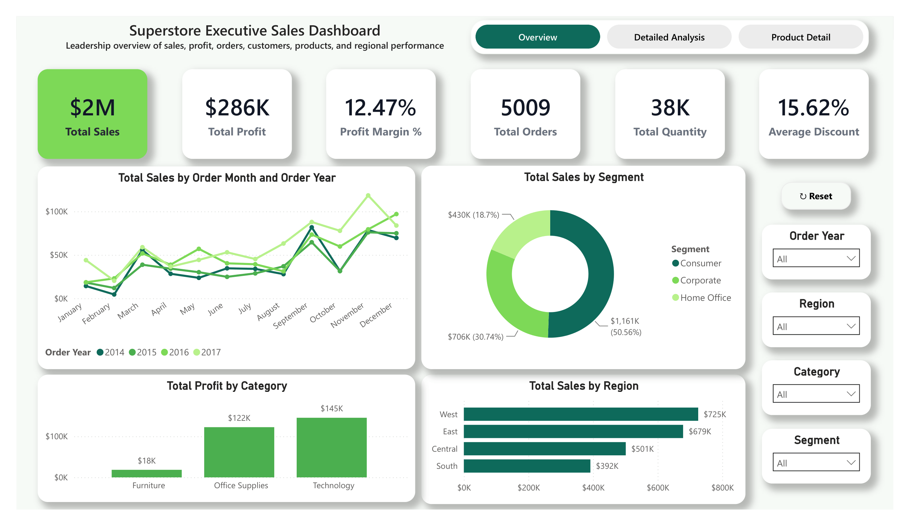
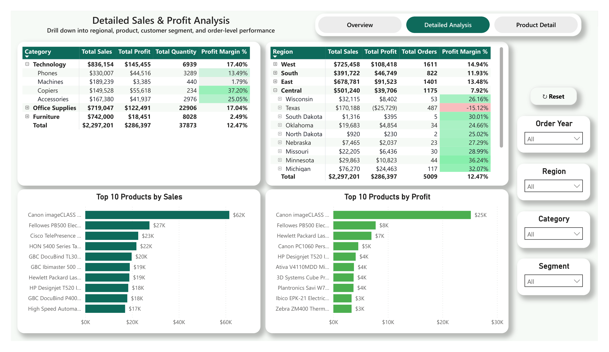
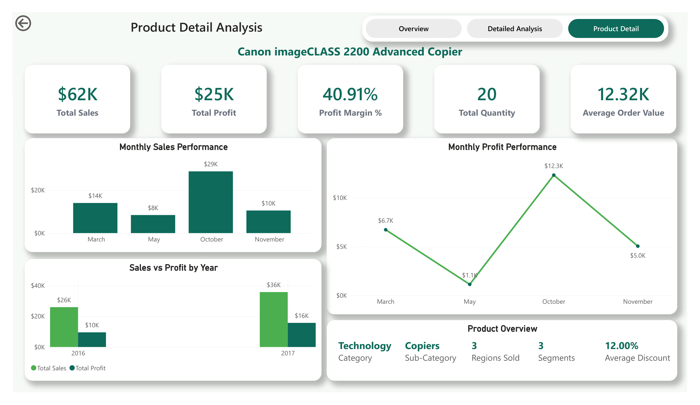

# Superstore Executive Dashboard

## Overview

This project is an executive-level Power BI dashboard created using the Sample Superstore dataset. It provides leadership with a clear view of sales, profit, orders, product performance, customer segments, and regional performance.

## Key KPIs

- Total Sales
- Total Profit
- Profit Margin
- Total Orders
- Total Quantity
- Average Discount

## Dashboard Pages

### 1. Executive Overview
Displays high-level KPIs, sales trends, regional performance, category performance, and customer segment analysis.

### 2. Detailed Analysis
Provides deeper analysis using product and regional hierarchies, Top 10 product visuals, filters, and drill-down features.

### 3. Product Detail
A drill-through page that displays product-level sales, profit, margin, quantity, and monthly performance.

## Tools Used

- Microsoft Power BI Desktop
- Power Query
- DAX
- Power BI Service
- Microsoft OneDrive / SharePoint Online
- Microsoft Excel

## Main Features

- Interactive KPI cards, charts, slicers, and filters
- Drill-down and drill-through analysis
- Reset filters and page navigation buttons
- Mobile-friendly layouts for all report pages
- Published report in Power BI Service
- Cloud data source stored in OneDrive
- Automated daily refresh and reporting

## Dashboard Screenshots

### Executive Overview



### Detailed Analysis



### Product Detail



## Automated Refresh Schedule

The Power BI semantic model is connected to `Superstore.xlsx` in OneDrive and refreshes automatically every day.

```text
Frequency: Daily
Time: 9:00 AM
Time Zone: UTC+05:30 Sri Jayawardenepura
Failure Notification: Enabled

After each successful refresh, the published report displays the latest data without reopening or republishing the Power BI Desktop file.